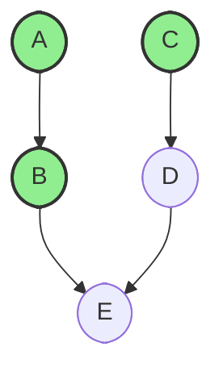

# shared-pages

Here is a simple flow chart:

## Workflow Graph

```mermaid
flowchart TD
    A([A]):::done --> B([B]):::done
    C([C]):::done --> D([D])
    B --> E([E])
    D --> E
    classDef done fill:#90ee90,stroke:#333,stroke-width:2px;
```

# Example Repo

This repository demonstrates how to use workflow status badges in GitHub Actions.
